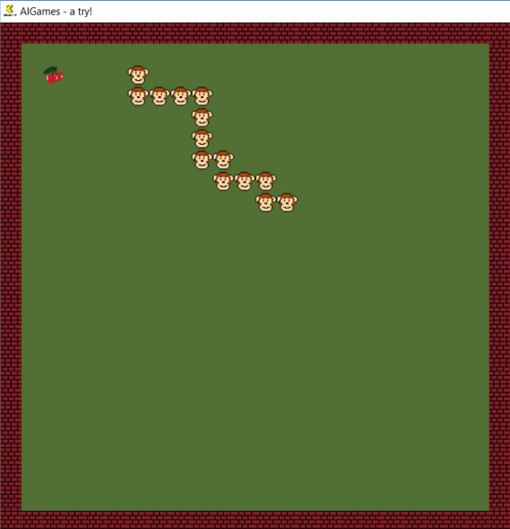

# A*-project

Solutions for some puzzles using A* algorithm

## Snake

The snake is a classical game where the user control a snake with the intent to eat food that appears randomly in the screen. The snake grows its size when eats food and it dies when "eats itself".

The optimal solution for this type of problem is so far more complicated than a simple search, but in this project the problem is reduced to a search. The goal of the search is the food and the obstacles are the snake body and walls. The image below shows a screenshot of this puzzle. (monkeys and cherrys are an internal joke :-) )

    
    
<b>Figure</b> Screenshot of the snake game 

